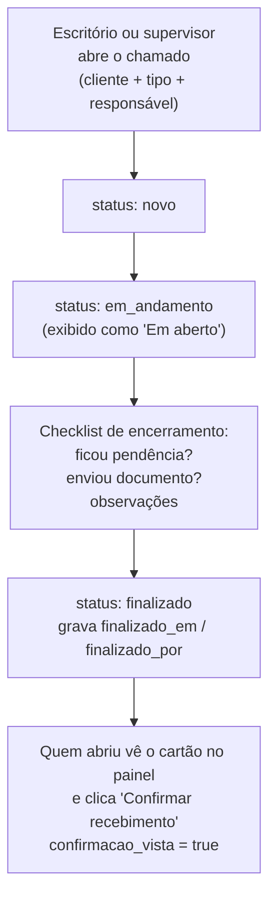
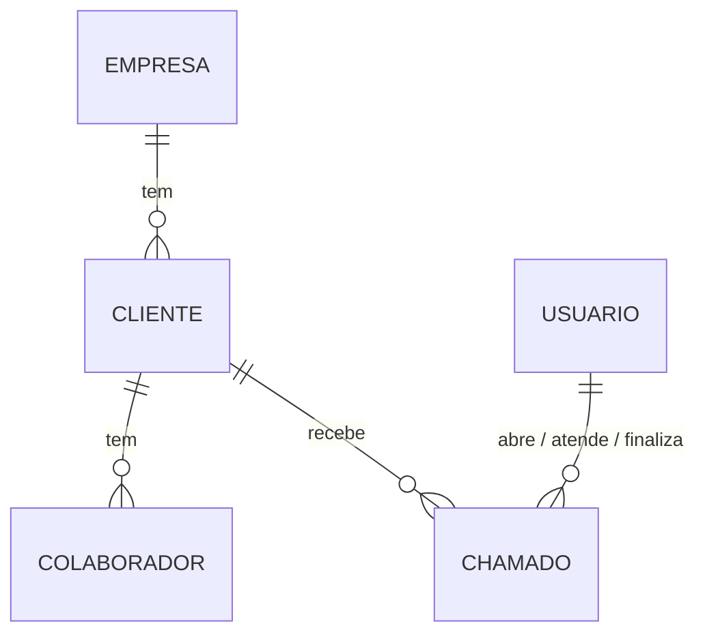

# operações · SolarSync

Sistema interno de gestão operacional para as empresas de zeladoria, limpeza e
manutenção do grupo. Substitui o vaivém de WhatsApp e planilhas entre o
**escritório** e os **supervisores de campo** por um registro único de chamados,
com histórico, responsável e confirmação de encerramento.

Em produção: `operacoes.solarsync.com.br`

---

## Índice

1. [O problema que o sistema resolve](#1-o-problema-que-o-sistema-resolve)
2. [Quem usa](#2-quem-usa)
3. [O processo central: o ciclo de um chamado](#3-o-processo-central-o-ciclo-de-um-chamado)
4. [Arquitetura e stack](#4-arquitetura-e-stack)
5. [Mapa do repositório](#5-mapa-do-repositório)
6. [Modelo de dados](#6-modelo-de-dados)
7. [Rotas: páginas e API](#7-rotas-páginas-e-api)
8. [Como rodar localmente](#8-como-rodar-localmente)
9. [Scripts operacionais](#9-scripts-operacionais)
10. [Deploy na VPS](#10-deploy-na-vps)
11. [Convenções de código](#11-convenções-de-código)
12. [Fluxo de trabalho no Git](#12-fluxo-de-trabalho-no-git)
13. [Estado atual e próximos passos](#13-estado-atual-e-próximos-passos)
14. [Pontos para decidirmos juntos](#14-pontos-para-decidirmos-juntos)

---

## 1. O problema que o sistema resolve

O grupo opera **4 empresas** que faturam separadamente — CORDSUL, KRETZER,
STAR SUL e FLC — atendendo hoje cerca de **160 clientes** (prédios, lojas,
condomínios, unidades comerciais). Em cada cliente há colaboradores
operacionais, e sobre cada cliente surgem demandas do dia a dia: falta material
de limpeza, quebrou algo, precisa entregar uniforme, a folha de ponto não
chegou, o cliente reclamou.

Antes, isso circulava em conversas soltas. O sistema transforma cada demanda em
um **chamado** com tipo, cliente, responsável, status e um checklist de
encerramento — de modo que ninguém precise perguntar "e aquilo, resolveu?".

**Distribuição atual da base** (conforme `app/seed_clientes.py`):

| Empresa   | Clientes |
|-----------|---------:|
| CORDSUL   | 50 |
| KRETZER   | 54 |
| STAR SUL  | 28 |
| FLC       | 28 |
| **Total** | **160** |

---

## 2. Quem usa

O sistema tem exatamente **dois papéis**, gravados no campo `usuarios.papel`:

| Papel | Quem é | O que enxerga |
|---|---|---|
| `supervisor` | Equipe de campo, que visita os clientes | Painel com **os chamados atribuídos a ele**, ocorrências, clientes e colaboradores |
| `escritorio` | Gerência e assistentes administrativos | Tudo o que o supervisor vê **+ a tela de Usuários** |

Ponto importante para não confundir os dois cadastros:

- **`Usuario`** = quem faz login no app (supervisores e escritório).
- **`Colaborador`** = funcionário operacional da zeladoria, vinculado a um
  cliente. **Não acessa o sistema** — existe apenas como registro, para o
  supervisor associar folha de ponto e documentos a alguém.

---

## 3. O processo central: o ciclo de um chamado



Três regras deste fluxo estão codificadas no backend e vale conhecê-las antes de
mexer em qualquer coisa de chamados:

1. **Não dá para finalizar por atalho.** O `PATCH /chamados-dados/{id}` recusa
   explicitamente `status: "finalizado"` — a finalização só acontece via
   `POST /chamados-dados/{id}/finalizar`, que exige o checklist preenchido.
2. **Checklist com validação condicional.** Marcou "houve pendência"? O detalhe
   vira obrigatório. Marcou "enviou documento"? Idem.
3. **Encerrar não é o fim.** Ao finalizar, `confirmacao_vista` volta para
   `false`, e o chamado aparece no painel de **quem o abriu** até que essa pessoa
   confirme que viu o desfecho. É esse passo que fecha o ciclo de comunicação.

### Tipos de chamado

`manutencao` · `material_limpeza` · `uniforme` · `documento` · `folha_ponto` ·
`reclamacao` · `seguranca` · `comercial` · `outros`

A lista vive em `TIPOS_CHAMADO`, no topo de `app/main.py`, e é servida ao
frontend por `GET /chamados-tipos` — as telas nunca repetem essa lista em código
JS. Para acrescentar um tipo novo, basta editar essa constante.

> Histórico útil: Ponto, Documentos e Uniformes já foram telas separadas. Viraram
> **tipos de chamado**, e as rotas antigas hoje redirecionam para `/ocorrencias`.
> Essa consolidação é a espinha dorsal do produto atual.

---

## 4. Arquitetura e stack

Aplicação monolítica simples, sem etapa de build no frontend.

```
Navegador
    |
    v
nginx (porta 80, na VPS)
    |  proxy_pass
    v
127.0.0.1:8002  ->  container "app"  (uvicorn + FastAPI, porta 8000)
                          |
                          v
                    container "db"  (PostgreSQL 16-alpine)
                    exposto só em 127.0.0.1:5433
```

| Camada | Tecnologia |
|---|---|
| Backend | Python 3.12, FastAPI 0.115, Uvicorn |
| ORM | SQLAlchemy 2.0 (estilo `Mapped` / `mapped_column`), síncrono |
| Banco | PostgreSQL 16 |
| Auth | JWT (PyJWT, HS256) + bcrypt para as senhas |
| Frontend | HTML + CSS + JavaScript puro, servido como arquivo estático |
| Infra | Docker Compose, nginx como proxy reverso |

**Não há framework de frontend, bundler, npm nem etapa de compilação.** O que
está em `app/static/` é exatamente o que chega ao navegador.

---

## 5. Mapa do repositório

```
.
├── .env.example                       # modelo das variáveis de ambiente
├── docker-compose.yml                 # serviços app + db
├── nginx-operacoes.solarsync.com.br   # site nginx (copiado à mão para a VPS)
└── app/
    ├── Dockerfile
    ├── requirements.txt               # dependências com versão fixada
    │
    ├── main.py                        # TODAS as rotas (API + páginas) — ~460 linhas
    ├── models.py                      # tabelas SQLAlchemy
    ├── schemas.py                     # modelos Pydantic (entrada/saída)
    ├── database.py                    # engine, SessionLocal, get_db()
    ├── security.py                    # hash de senha e emissão/leitura de JWT
    │
    ├── init_db.py                     # cria as tabelas
    ├── seed_clientes.py               # popula as 4 empresas e os 160 clientes
    ├── atualizar_cnpjs.py             # preenche o CNPJ dos clientes
    ├── criar_usuario.py               # cria usuário interativamente
    ├── migrar_checklist_finalizacao.py# migração manual e idempotente
    │
    └── static/
        ├── style.css                  # folha de estilo única (~876 linhas)
        ├── shell.js                   # casca compartilhada por todas as telas
        ├── login.html / login.js
        ├── dashboard.html / dashboard.js
        ├── clientes.html / clientes.js
        ├── colaboradores.html / colaboradores.js
        ├── ocorrencias.html / ocorrencias.js
        ├── usuarios.html / usuarios.js
        └── em-breve.html / em-breve.js # placeholder dos módulos futuros
```

### `shell.js` é a peça central do frontend

Todas as telas internas carregam `shell.js` **antes** do seu próprio script.
Ele expõe o objeto `Shell` e cuida de:

- **`Shell.montar(paginaAtiva, titulo)`** — desenha o menu lateral (escondendo
  itens que o papel do usuário não pode ver), a topbar com nome/papel/sair, e o
  botão "+ Abrir chamado". Redireciona para `/login` se não houver sessão.
  Retorna os dados do usuário logado.
- **`Shell.chamarApi(caminho, opcoes)`** — único ponto de saída HTTP autenticado.
  Anexa o `Bearer` token, faz logout automático em `401`, e transforma erros em
  `Error` com `.status` e `.detalhe`. **Toda chamada nova à API deve passar por
  aqui.**
- **O modal de abrir chamado** — como ele mora na casca, o botão funciona em
  qualquer tela sem duplicação.
- **`Shell.icone(chave)`** — os ícones SVG são inline, em um dicionário no topo
  do arquivo. Não há biblioteca de ícones.

A sessão fica em `localStorage`, na chave **`operacoes_auth`** (JSON com
`access_token`, `id`, `nome`, `papel`). Token válido por **7 dias** —
escolha deliberada, registrada em `security.py`, para não pedir login o tempo
todo a uma equipe pequena que usa muito o celular.

---

## 6. Modelo de dados



| Tabela | Papel | Observações |
|---|---|---|
| `empresas` | As 4 empresas faturadoras | `nome` é único |
| `clientes` | Local/unidade atendida | Único por `(empresa_id, nome)`. O CNPJ **pode repetir** entre clientes — são unidades de uma mesma rede |
| `colaboradores` | Funcionário operacional | Vinculado a um cliente. Sem login |
| `usuarios` | Quem acessa o app | `email` único, `papel` = `supervisor` ou `escritorio`, senha em bcrypt |
| `chamados` | A demanda operacional | O coração do sistema |

A tabela `chamados` carrega três blocos de campos:

- **Abertura** — `cliente_id`, `tipo`, `descricao`, `aberto_por_id`,
  `responsavel_id`, `criado_em`.
- **Encerramento** — `finalizado_em`, `finalizado_por_id`,
  `fechamento_pendencia` (+ detalhe), `fechamento_documento_enviado`
  (+ detalhe), `fechamento_observacoes`. Todos nulos enquanto o chamado
  não é finalizado.
- **Confirmação** — `confirmacao_vista`, o booleano que fecha o ciclo.

Datas sempre em **UTC com timezone** (`DateTime(timezone=True)`, helper
`agora_utc()` em `models.py`). A conversão para o horário local acontece no
navegador, com `toLocaleDateString('pt-BR')`.

---

## 7. Rotas: páginas e API

### Convenção importante do projeto

O FastAPI serve as páginas HTML **e** a API no mesmo domínio, sem prefixo
`/api`. Quando o caminho bonito já está ocupado pela página, o endpoint de dados
ganha o sufixo **`-dados`**:

| Caminho | Devolve |
|---|---|
| `/clientes` | a página HTML |
| `/clientes-dados` | o JSON |

Vale para `clientes`, `colaboradores`, `usuarios` e `chamados`. Endpoints que
não têm página homônima (`/empresas`, `/supervisores`) não levam o sufixo.

### Públicas — sem token

| Método | Rota | Para quê |
|---|---|---|
| GET | `/` | Ping simples com o nome do app |
| GET | `/health` | Healthcheck |
| GET | `/stats` | Contagem de empresas e clientes — alimenta o painelzinho da tela de login |
| POST | `/auth/login` | Recebe `{email, senha}` e devolve o token + dados do usuário |

### Autenticadas — header `Authorization: Bearer <token>`

| Método | Rota | Observações |
|---|---|---|
| GET | `/auth/me` | Dados do usuário do token |
| GET | `/dashboard/resumo` | KPIs + clientes por empresa. Se for supervisor, inclui `meus_chamados`; para qualquer um, inclui `chamados_para_confirmar` |
| GET | `/empresas` | id + nome |
| GET | `/clientes-dados` | Filtro opcional `?empresa_id=` |
| GET | `/colaboradores-dados` | Filtro opcional `?cliente_id=` |
| GET | `/usuarios-dados` | **Restrito a `escritorio`** (403 para supervisor) |
| GET | `/supervisores` | Lista enxuta para preencher o campo "responsável" |
| GET | `/chamados-tipos` | Tipos e status com seus rótulos |
| POST | `/chamados-dados` | Abre chamado. Valida tipo, cliente, responsável (precisa ser supervisor ativo) e descrição não vazia |
| GET | `/chamados-dados` | Filtros: `status_filtro` (aceita `aberto` = tudo que não está finalizado), `tipo`, `cliente_id`, `empresa_id`, `responsavel_id`, `data_inicio`, `data_fim` (ISO `AAAA-MM-DD`) |
| PATCH | `/chamados-dados/{id}` | Troca o status. **Recusa `finalizado`** |
| POST | `/chamados-dados/{id}/finalizar` | Aplica o checklist e finaliza |
| POST | `/chamados-dados/{id}/confirmar` | Marca `confirmacao_vista = true` |

### Páginas HTML

`/login` · `/dashboard` · `/clientes` · `/colaboradores` · `/ocorrencias` ·
`/usuarios` · `/avisos` (placeholder "em construção")

**Redirecionamentos legados:** `/painel` → `/dashboard`;
`/ponto`, `/documentos` e `/uniformes` → `/ocorrencias`.

### Documentação automática

Como é FastAPI, o Swagger sai de graça em **`/docs`** e o ReDoc em **`/redoc`**.
As páginas HTML ficam de fora do schema (`include_in_schema=False`), então o
`/docs` mostra só a API de verdade — é o melhor lugar para explorar antes de
escrever código.

---

## 8. Como rodar localmente

**Pré-requisitos:** Docker e Docker Compose. Nada de Python ou Node na máquina —
tudo roda em container.

```bash
# 1. Clonar
git clone https://github.com/sidneimsf/operacoes.git
cd operacoes

# 2. Criar o .env a partir do modelo
cp .env.example .env

# 3. Gerar uma chave JWT só sua e colar no .env (JWT_SECRET_KEY)
python3 -c "import secrets; print(secrets.token_hex(32))"

# 4. Subir os containers
docker compose up -d --build

# 5. Criar as tabelas
docker compose exec app python init_db.py

# 6. Popular empresas, clientes e CNPJs
docker compose exec app python seed_clientes.py
docker compose exec app python atualizar_cnpjs.py

# 7. Criar seu usuário (o -it é necessário: o script é interativo)
docker compose exec -it app python criar_usuario.py
```

Pronto:

- Aplicação → <http://localhost:8002/login>
- Swagger → <http://localhost:8002/docs>
- Postgres → `localhost:5433` (usuário/senha/base conforme seu `.env`)

Ambas as portas ficam presas a `127.0.0.1` no `docker-compose.yml` — nada é
exposto para fora da máquina.

### Ciclo de desenvolvimento

O `Dockerfile` faz `COPY . .` e a aplicação sobe **sem `--reload`**, e não há
volume de código montado. Ou seja: **alterou qualquer arquivo — Python, JS, HTML
ou CSS — precisa reconstruir a imagem:**

```bash
docker compose up -d --build app
```

```bash
docker compose logs -f app      # acompanhar os logs
docker compose exec app bash    # abrir um shell no container
docker compose down             # parar tudo (o volume db_data continua lá)
docker compose down -v          # zerar o banco também — cuidado
```

> Um `docker compose watch` ou um bind mount com `--reload` deixaria isso bem
> mais rápido. Está na lista da [seção 14](#14-pontos-para-decidirmos-juntos)
> para combinarmos.

### Variáveis de ambiente

| Variável | Para quê |
|---|---|
| `DB_USER`, `DB_PASSWORD`, `DB_NAME` | Consumidas pelo container do Postgres |
| `DATABASE_URL` | String de conexão que a aplicação usa. Dentro do Compose o host é `db` (nome do serviço) — se um dia rodar o uvicorn fora do Docker, troque para `localhost:5433` |
| `JWT_SECRET_KEY` | Assina os tokens. **Diferente entre local e produção.** Trocar essa chave derruba todas as sessões ativas |

O `.env` está no `.gitignore` e **nunca** deve ser versionado. Ao acrescentar uma
variável nova, atualize o `.env.example` no mesmo commit — é o único registro
de quais variáveis existem.

---

## 9. Scripts operacionais

Todos ficam em `app/` e rodam dentro do container, tanto local quanto na VPS.
Cada um traz uma docstring "COMO USAR" no topo.

| Script | O que faz | Idempotente? |
|---|---|---|
| `init_db.py` | `Base.metadata.create_all()` — cria as tabelas que ainda não existem | Sim, mas **não altera tabelas já criadas** |
| `seed_clientes.py` | Cadastra as 4 empresas e os 160 clientes | Sim — usa nome da empresa + nome do cliente como chave |
| `atualizar_cnpjs.py` | Preenche o `cnpj` dos clientes já cadastrados | Sim — só atualiza o campo, não cria nada |
| `criar_usuario.py` | Cria usuário interativamente (pede nome, e-mail, papel, senha oculta) | Recusa e-mail já existente |
| `migrar_checklist_finalizacao.py` | Adiciona as colunas do checklist a uma tabela `chamados` que já tem dados | Sim — usa `ADD COLUMN IF NOT EXISTS` |

**Como o projeto lida com mudança de schema hoje:** não há Alembic. `init_db.py`
resolve tabelas novas; **coluna nova em tabela existente exige um script
`migrar_*.py` escrito à mão**, sempre idempotente e sem apagar dados. Use
`migrar_checklist_finalizacao.py` como modelo. É por isso que uma alteração em
`models.py` **não** chega ao banco sozinha.

---

## 10. Deploy na VPS

O deploy é manual, com `git pull` e rebuild.

```bash
# na VPS, no diretório do projeto
git pull origin main
docker compose up -d --build

# se a alteração incluiu schema, rodar a migração correspondente
docker compose exec app python migrar_<algo>.py
```

O nginx da VPS é configurado uma única vez com o arquivo versionado aqui:

```bash
sudo cp nginx-operacoes.solarsync.com.br /etc/nginx/sites-available/
sudo ln -s /etc/nginx/sites-available/nginx-operacoes.solarsync.com.br \
           /etc/nginx/sites-enabled/
sudo nginx -t && sudo systemctl reload nginx
```

Ele escuta em `operacoes.solarsync.com.br:80` e repassa para `127.0.0.1:8002`,
encaminhando `Host`, `X-Real-IP`, `X-Forwarded-For` e `X-Forwarded-Proto`.

> O arquivo versionado cobre apenas a porta 80. O HTTPS é configurado
> diretamente no servidor (certbot), fora do repositório — leve isso em conta ao
> comparar o arquivo daqui com o que está de fato na VPS.

---

## 11. Convenções de código

Vale seguir o padrão que já está estabelecido — ele é consistente no repositório
inteiro:

**Idioma.** Tudo em português: nomes de variáveis, funções, rotas, tabelas e
colunas (`abrir_chamado`, `usuario_atual`, `chamados-dados`, `criado_em`).

**Acentuação.** Código, comentários e docstrings ficam em **ASCII, sem acento**
("Cria um usuario de forma interativa"). Texto que o usuário lê na tela vai
acentuado normalmente ("Ocorrências", "Não foi possível carregar").

**Backend**
- Todas as rotas ficam em `main.py`, agrupadas por comentários de seção
  (`# --- Autenticacao ---`). Ainda não usamos `APIRouter`.
- Autenticação via dependência `usuario_atual`; restrição por papel via
  `exigir_papel("escritorio")`.
- Listas de domínio (tipos, status) são constantes no topo de `main.py` e
  chegam ao frontend por endpoint — nunca duplicadas no JS.
- Serialização de chamado passa sempre por `serializar_chamado()`, para que
  todas as telas recebam o mesmo formato.
- Erros de negócio como `HTTPException` com `detail` em português — o frontend
  exibe esse `detail` direto para o usuário.

**Frontend**
- Uma página = um HTML + um JS de mesmo nome. Sem framework, sem build.
- O JS da página começa com `const auth = Shell.montar('<chave>', '<Título>');`.
- Toda chamada à API passa por `Shell.chamarApi`.
- Estilo só em `style.css`, dividido por seções comentadas. Sem CSS inline
  além de larguras calculadas (as barras do painel).
- Toda tela tem seus três estados escritos à mão: `loading-state`,
  `empty-state` e a mensagem de erro.

**Dependências.** Versões fixadas em `requirements.txt` (`fastapi==0.115.0`).
Sem faixas de versão.

---

## 12. Fluxo de trabalho no Git

Branch principal: **`main`**.

Agora que somos dois, a sugestão é:

```bash
git checkout main
git pull origin main
git checkout -b <seu-nome>/<assunto-curto>   # ex: darci/tela-avisos

# ... trabalhar, commitar ...

git push -u origin <sua-branch>
# abrir Pull Request para main, o outro revisa, e aí sim faz merge
```

**Mensagens de commit** seguem o padrão que o Sidnei já usa: verbo no imperativo,
em português, sem acento, descrevendo o efeito e não o arquivo.

```
Adiciona checklist de finalizacao e confirmacao do escritorio
Adiciona script de atualizacao de CNPJ
Versao inicial do projeto
```

**Combinados que evitam dor de cabeça:**

- Nunca commitar `.env`, dump de banco ou dado real de cliente.
- Alteração em `models.py` vem acompanhada do script `migrar_*.py`
  correspondente, no mesmo commit.
- Variável de ambiente nova vem acompanhada da linha no `.env.example`.
- Combinar antes de mexer em `main.py` e `shell.js` ao mesmo tempo — são os dois
  arquivos que centralizam tudo e onde conflito é mais provável.

---

## 13. Estado atual e próximos passos

**Funcionando hoje**

- Login com JWT e sessão de 7 dias
- Painel com KPIs, clientes por empresa, chamados do supervisor e cartões de
  confirmação
- Ocorrências: abertura, listagem com 7 filtros, troca de status, checklist de
  finalização e confirmação
- Clientes: listagem com chips por empresa e CNPJ
- Colaboradores: listagem (somente leitura)
- Usuários: listagem restrita ao escritório

**Em construção / previsto**

| Item | Situação |
|---|---|
| **Avisos** — mural de comunicação por assunto ou cliente, para acabar com as conversas cruzadas | Tela placeholder em `/avisos`. O endpoint `/avisos-dados` está previsto num comentário no fim de `main.py`. **É o próximo módulo** |
| Cadastro de colaboradores pela interface | A tabela e a listagem existem; falta a tela e o endpoint de criação |
| Cadastro de clientes e usuários pela interface | Hoje só por script (`seed_clientes.py`, `criar_usuario.py`) |
| Edição e inativação de registros | Nenhum `PUT`/`DELETE` existe ainda — o campo `ativo` já está lá em `clientes`, `colaboradores` e `usuarios`, mas nada o altera |

---

## 14. Pontos para decidirmos juntos

Levantados na leitura do código. Nenhum é bug — são decisões conscientes de um
projeto pequeno, que talvez valha revisitar agora que a base cresceu e somos dois
mexendo nele.

1. **Migrações à mão.** Cada coluna nova exige um `migrar_*.py`. Adotar Alembic
   agora resolve isso de vez, mas custa uma migração inicial para capturar o
   schema atual. Vale a pena?
2. **Sem testes automatizados.** Um `pytest` com o `TestClient` do FastAPI
   cobrindo o fluxo do chamado (abrir → andamento → finalizar → confirmar)
   já daria uma boa rede de proteção antes de mexermos em quatro mãos.
3. **Autorização fina.** Só `/usuarios-dados` checa papel. Qualquer usuário
   autenticado pode alterar o status ou finalizar **qualquer** chamado, mesmo
   os de outro supervisor. Numa equipe pequena isso é aceitável e provavelmente
   intencional — só precisa ser uma escolha explícita.
4. **Escape de HTML no frontend.** As telas montam linhas com template string +
   `innerHTML`, incluindo texto vindo do banco (descrição de chamado, nome de
   cliente). Como todo mundo que digita é da equipe, o risco hoje é baixo; se um
   dia entrar texto vindo de fora, precisa de escaping.
5. **Ciclo de desenvolvimento lento.** Sem volume nem `--reload`, mudar uma
   vírgula no CSS exige rebuild. Um `docker-compose.override.yml` local resolveria
   sem afetar produção.
6. **Dados de CNPJ.** Alguns registros em `atualizar_cnpjs.py` são na verdade
   CPF (ex.: `GALERIA (SELITO)`). O campo é `String(20)` e aceita, mas vale
   alinhar como queremos tratar cliente pessoa física.
7. **Sem healthcheck no Compose.** O `app` depende do `db`, mas `depends_on` não
   espera o Postgres ficar pronto — o `pool_pre_ping` do SQLAlchemy cobre boa
   parte, mas o primeiro boot pode dar erro.
8. **Deploy manual.** `git pull` + `--build` na VPS funciona, mas não deixa
   registro do que foi para produção e quando.

---

## Referência rápida

```bash
docker compose up -d --build            # subir / aplicar mudanças
docker compose logs -f app              # ver logs
docker compose exec app python init_db.py
docker compose exec -it app python criar_usuario.py
docker compose exec app bash            # shell no container
docker compose down                     # parar (mantém o banco)
```

| Recurso | Onde |
|---|---|
| Aplicação (local) | <http://localhost:8002/login> |
| Swagger (local) | <http://localhost:8002/docs> |
| Postgres (local) | `localhost:5433` |
| Produção | `operacoes.solarsync.com.br` |
| Sessão no navegador | `localStorage` → chave `operacoes_auth` |
